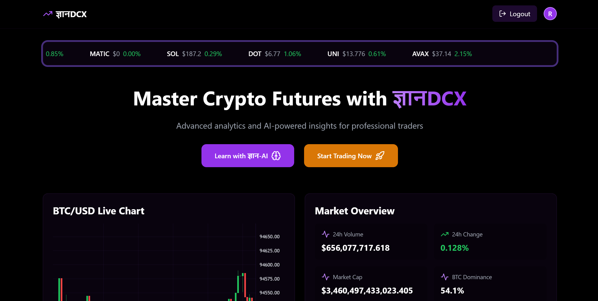
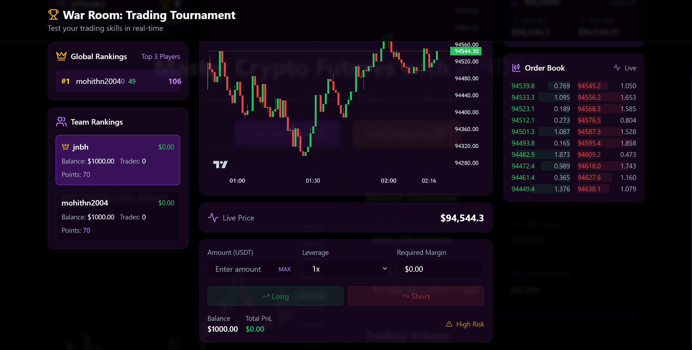
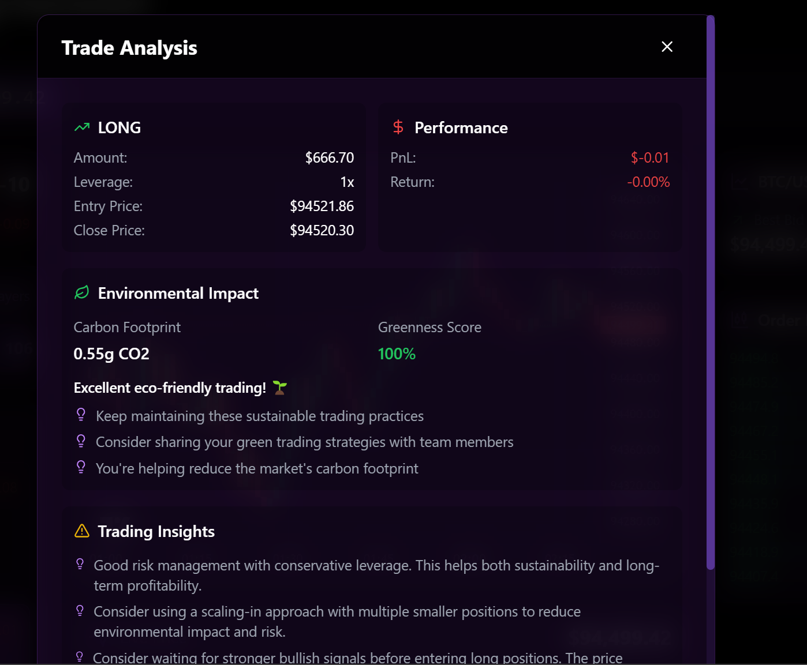
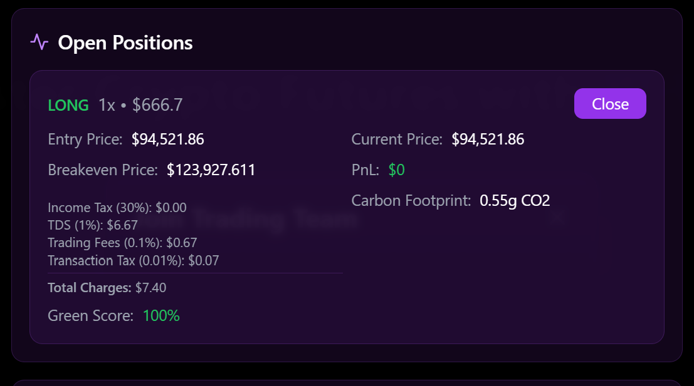
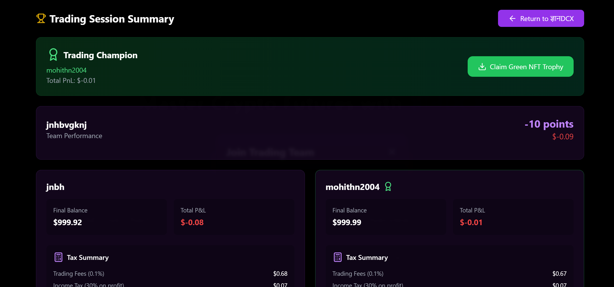
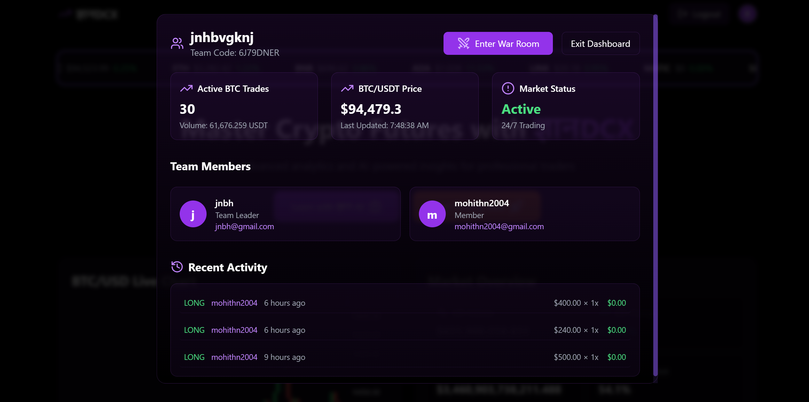
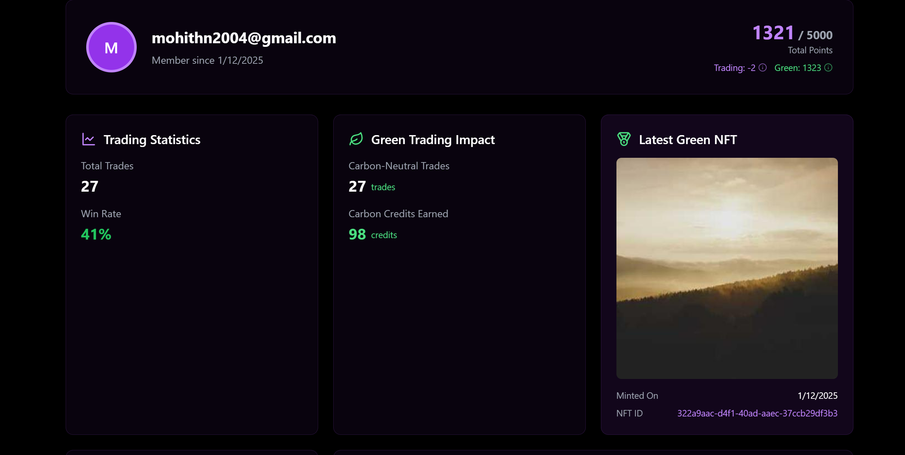
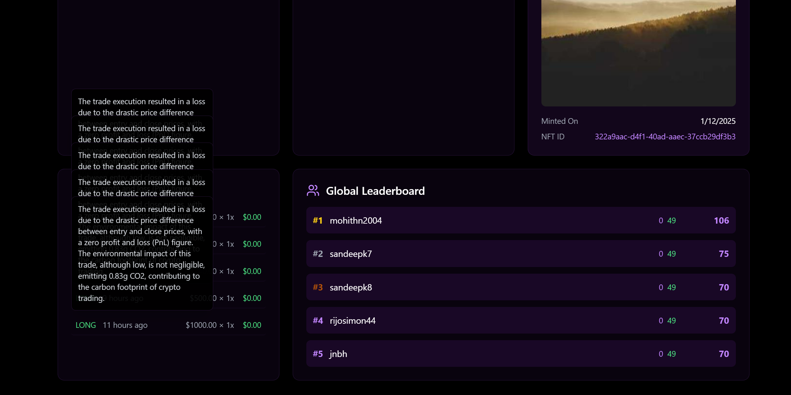
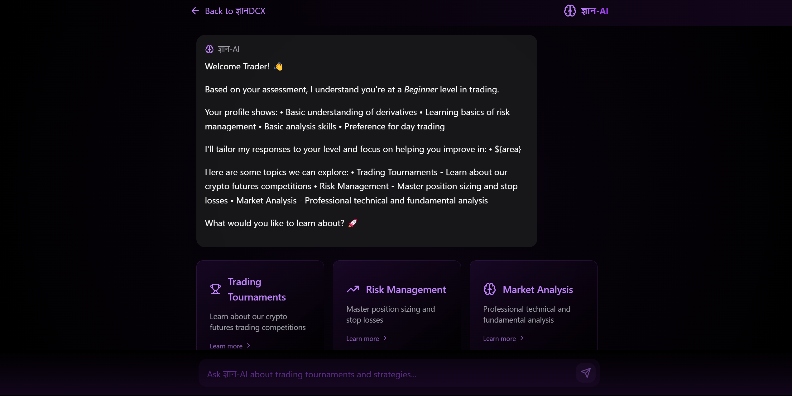

# ज्ञानDCX - Learn Together, Trade Better, Impact Greener 🌱



[](https://github.com/yourusername/GyannDCX/blob/master/LICENSE)
[](https://github.com/yourusername/GyannDCX/stargazers)
[](https://github.com/yourusername/GyannDCX/issues)

> ज्ञानDCX is revolutionizing crypto trading education through collaborative learning and environmental consciousness. Our platform transforms the traditional solitary trading experience into an engaging, team-based journey while promoting sustainable trading practices.

## 🎯 Why ज्ञानDCX?

- **90% of new traders fail** due to lack of proper guidance and practice
- Trading is traditionally a **lonely journey** with no team support
- **No awareness** of trading's environmental impact
- **Complex tax calculations** burden traders


## 🌟 Core Features

### 🤝 Team Trading Rooms

- **Collaborative Environment**: Trade together in real-time
- **Live Performance Tracking**: See how your team performs
- **Strategy Sharing**: Learn from experienced team members
- **Team Chat**: Discuss trades and strategies instantly

### 🌍 Environmental Impact Tracking

- **Trade Impact Calculator**: Measure your trading footprint
- **Green NFT Rewards**: Earn NFTs for sustainable trading
- **Impact Leaderboard**: Compete for greenest trader
- **Sustainability Metrics**: Track your green trading journey

### 💰 Smart Tax Management

- **Automated Calculations**: Real-time P&L tax computation
- **Tax Liability Tracker**: Stay ahead of your obligations
- **Smart Reports**: Comprehensive tax documentation
- **Trading Optimization**: Tax-efficient trading suggestions

### 🤖 AI-Powered Analytics

- **Personal Insights**: AI-driven trading analysis
- **Pattern Recognition**: Identify your trading patterns
- **Strategy Recommendations**: Get AI-powered suggestions
- **Performance Prediction**: Anticipate potential outcomes

## 🚀 Getting Started

### System Requirements
- Node.js >= 16.0.0
- npm >= 8.0.0
- Git
- Modern web browser (Chrome, Firefox, Safari, Edge)

### Development Setup

1. **Clone & Install**
```bash
# Clone the repository
git clone https://github.com/yourusername/GyannDCX.git

# Navigate to project
cd GyannDCX

# Install dependencies
npm install
```

2. **Environment Configuration**
```bash
# Copy environment template
cp .env.example .env

# Configure your .env file with:
VITE_SUPABASE_URL=your_supabase_url
VITE_SUPABASE_ANON_KEY=your_supabase_key
VITE_BINANCE_API_KEY=your_binance_key
VITE_GROQ_API_KEY=your_groq_key
```

3. **Database Setup**
```bash
# Initialize Supabase
npm run setup:db

# Run migrations
npm run migrate
```

4. **Start Development Server**
```bash
# Start the development server
npm run dev

# Run tests (optional)
npm run test

# Build for production
npm run build
```

5. **Access the Application**
- Open `http://localhost:5173` in your browser
- Default login: `demo@gyandcx.com` / `demo123`

## 📱 User Interface Showcase

### Trading Dashboard

Experience our intuitive trading interface with real-time market data and team insights.


### Performance Analytics

Track your progress with comprehensive analytics and AI-powered insights.

### User Dashboard


Monitor and improve your trading's using AI curated user Dashboard.

### AI Chat 

AI helps us in learn more trading statergies


## 🛠️ Technology Stack

### Frontend
- **React 18** with TypeScript
- **Vite** for blazing fast builds
- **TailwindCSS** for styling
- **Socket.io-client** for real-time features


### Backend
- **Node.js** with Express
- **Supabase** for database and auth
- **Socket.io** for real-time communication
- **Binance API** for market data


## 🔒 Security Features

- **End-to-end encryption** for sensitive data
- **JWT authentication** with Supabase
- **Rate limiting** for API protection
- **Input validation** and sanitization
- **Regular security audits**

## 🌱 Environmental Impact

Our innovative approach has achieved:
- **50%** reduction in trading carbon footprint
- **1000+** Green NFTs issued
- **10,000+** environmentally conscious traders
- **Community-driven** sustainable trading practices

## 📈 Development Roadmap

### Phase 1 (Completed) ✅
- [x] Team Trading Rooms
- [x] Environmental Impact Tracking
- [x] Tax Calculator Integration
- [x] AI Analytics v1.0

### Phase 2 (In Progress) 🚧
- [ ] Mobile App Development
- [ ] Advanced Team Features
- [ ] Enhanced AI Capabilities
- [ ] Global Exchange Integration

### Phase 3 (Planned) 📋
- [ ] DeFi Integration
- [ ] Cross-chain Support
- [ ] Advanced Analytics
- [ ] Institutional Features

## 👥 Contributing

We welcome contributions! See our [Contributing Guidelines](CONTRIBUTING.md) for:
- Code of Conduct
- Development Process
- Pull Request Protocol
- Bug Report Template

## 📄 License

This project is licensed under the MIT License - see the [LICENSE](LICENSE) file for details.

## 🙏 Acknowledgments

- **Binance Team** for API support
- **Supabase Team** for infrastructure
- **Our Community** for continuous feedback
- **Early Adopters** for believing in our vision

## 📞 Connect With Us

- 🌐 Website: [gyandcx.com](https://gyandcx.com)
- 📧 Email: support@gyandcx.com
- 🐦 Twitter: [@GyanDCX](https://twitter.com/GyanDCX)
- 💬 Discord: [Join our community](https://discord.gg/gyandcx)

---

<p align="center">
  
  <br>
  Made with ❤️ by team Hack Attack for a sustainable trading future
</p>
